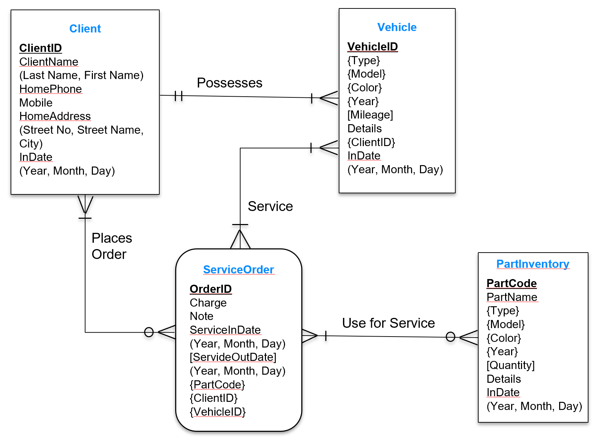

# Database-ERD (Entity Relational Diagram )

- the method of presenting the Entity Relational model with graphics

        - Entity:“A person, a place, an object, an event, or a concept in the user environment about 
                which the organization wishes to maintain data”  
        
        - Entity Type: “A collection of entities that share common properties or characteristics” 
        
        - Entity Instance: “A single occurrence of an entity type” 

- Attribute:
        “A property or Characteristic of an entity or relationship type that is of interest to the organization”

- Required Attribute:
        “An attribute that must have a value for every entity (or relationship)  instance with which it is associated” 

- Optional Attribute:
        “An attribute that may not have a value for every entity (or relationship) instance with which it associates “

- Composite Attribute:	
        “An attribute that has meaningful component parts (attributes)” 

- Simple(or Atomic) Attribute:	
        “An attribute that cannot be broken down into smaller components that are meaningful to the organization

- Multivalued Attribute:	
        “An attribute that may take on more than one value for a given entity (or relationship) instance “

- Derived Attribute:	
        “An attribute whose values can be calculated from related attribute values” (Hoffer 

- Identifier:	
        “An attribute (or a combination of attributes) whose value distinguishes instances of an entity type” 

- Relationships (Association Relationship)
        Represent the interaction between entities  

- Relationship type:	
        “A meaningful association between (or among) entity types” 

- Degree of a relationship Number of entity types that participate in a relationship
       
     - Unary (degree 1), recursive relationship : between entity instances of the same entity type  
     
     - Binary (degree 2): between instances of two entity types        
     
     - Ternary (degree 3): among the instances of three entity   
        

# ERD

